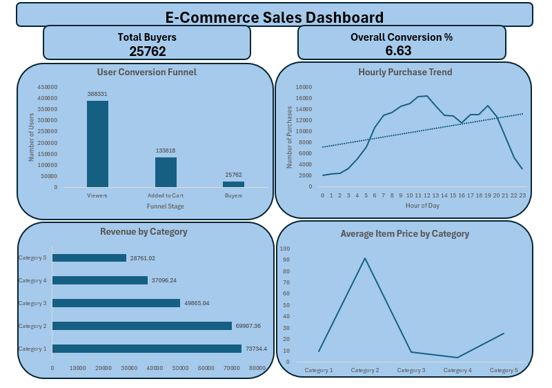

# 📊 E-Commerce Sales Analytics | SQL + Excel | Business Intelligence Project

## 🚀 Executive Summary

This end-to-end analytics project evaluates user behavior, conversion efficiency, revenue concentration, and customer value within an e-commerce dataset using SQL (SQLite) and Excel.

The objective was to simulate how a data analyst supports product, marketing, and revenue teams by identifying funnel drop-offs, revenue-driving categories, high-value customers, and peak demand patterns.

Complete workflow:
Raw Data → SQLite Database → SQL Analysis → Business Insights → Executive Dashboard

---

## 🧠 Business Questions Answered

• Where are users dropping off in the conversion funnel?  
• What is the overall conversion rate?  
• Who are the highest value (VIP) customers?  
• Which product categories generate the most revenue?  
• How efficient are category-level conversions?  
• What are the peak purchasing hours and top sales days?  

---

## 🛠 Tech Stack

- SQL (SQLite)
- DB Browser for SQLite
- Microsoft Excel (Dashboard & Visualization)
- CTE (WITH clauses)
- Aggregations (COUNT, SUM, AVG)
- CASE WHEN conditional logic
- NULLIF for division-by-zero handling

---

## 📂 Repository Structure

```
Ecommerce-Sales-Analysis/
│
├── sql/
│   └── sales_analysis.sql       
│
├── dashboard/
│   └── ecommerce_dashboard.xlsx   
│
├── images/
│   └── dashboard_preview.png     
│
└── README.md

```


## 🔍 Analytical Framework

### 1️⃣ Conversion Funnel Analysis
- DISTINCT user-level aggregation to prevent double-counting
- View → Cart → Purchase tracking
- Drop-off rate calculation
- Overall conversion percentage measurement

### 2️⃣ VIP Customer Segmentation
- Top 10 users ranked by purchase frequency
- Revenue contribution analysis
- Average Order Value (AOV) calculation

### 3️⃣ Product Revenue Performance
- Revenue vs Sales Volume comparison
- Category-level aggregation
- Top 5 revenue-generating categories identified

### 4️⃣ Category Conversion Optimization
- CASE WHEN conditional aggregation
- NULLIF used to prevent division-by-zero errors
- HAVING filter applied to high-traffic categories

### 5️⃣ Traffic & Demand Analysis
- Hour-of-day purchase trend detection
- Peak daily buyer identification
- Sales timing pattern evaluation

---

## 📈 Key Results

- Total Buyers: 25,762  
- Overall Conversion Rate: 6.63%  
- Revenue concentrated in top-performing categories  
- VIP customers contribute disproportionate revenue  
- Peak purchase hours identified  

---

## 📊 Dashboard Preview



---

## 💡 Business Impact

✔ Identified conversion bottlenecks  
✔ Highlighted high-value customer segments  
✔ Detected revenue-driving product categories  
✔ Provided time-based sales optimization insights  
✔ Delivered executive-ready dashboard for decision-makers  

---

## 📌 Skills Demonstrated

- Data Structuring & Cleaning
- SQL Query Optimization using CTEs
- Funnel Optimization Analysis
- Revenue & Customer Segmentation
- Business KPI Modeling
- Data Storytelling through Dashboard

---

## 📦 Data Availability

The original raw dataset and generated SQLite database file are not included in this repository due to GitHub file size limitations.

This repository contains:

- SQL scripts
- Python analysis script
- Processed cohort output tables
- Visualization outputs

To fully reproduce the end-to-end pipeline (data cleaning, cohort modeling, retention analysis, and LTV calculation), the original dataset and database file must be downloaded separately.

---

## 📎 Full Dataset & Database Download

Due to GitHub’s file size restrictions, the complete raw dataset and SQLite database file are hosted externally.

🔗 Download full project files here:  
https://drive.google.com/drive/folders/1ErLSVmlGwj6E0NThRxg2HEKURC5zoBtb?usp=sharing

After downloading:

1. Place the raw dataset inside the `data/` folder.
2. Place the SQLite database file in the project root directory (or as required).
3. Execute the SQL script located in the `sql/` directory.
4. Run the Python script to generate visualizations.

---

## 👤 Author

Y. Rithvesh  
SQL | Data Analytics | Business Intelligence  
Date: 05-02-2026
